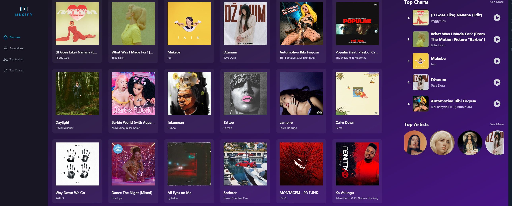
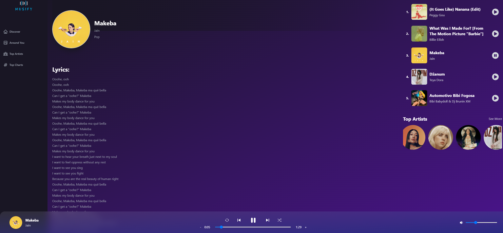

# MusiFy



## Table of Contents

1. [Introduction](#introduction)
2. [Features](#features)
3. [Installation](#installation)
4. [Usage](#usage)
5. [Demo](#demo)
6. [Contributing](#Contributing)
7. [License](#license)

## Introduction

## Features

1. **:**
2. **:**
3. **:**
4. **:**

## Installation

Follow these steps to install the Film Library:

1. Clone this repository:

```
git clone https://github.com/Artur0705/musify.git
```

2. Navigate to the project folder:

```
cd musify
```

3. Create a `.env` file and add your `API keys`:

```
`VITE_SHAZAM_CORE_RAPID_API_KEY="YOUR_API_KEY"`
`VITE_GEO_API_KEY="YOUR_API_KEY"`
```

4. Install the project dependencies:

```
npm install
```

5. Start the application:

```
npm start
```

## Usage

## Demo

- Please follow the [link]() or click on the image to visit the deployed application on GitHub and test it. [](https://)

## Contributing

- Pull requests are welcome. For major changes, please open an issue first to discuss what you would like to change.

## License


- This project is licensed under the [MIT](https://choosealicense.com/licenses/mit/)
